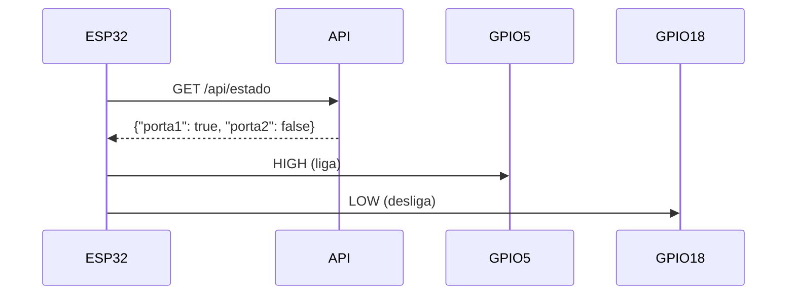

Claro! Aqui está um modelo de **README.md** pronto para você usar no GitHub para esse projeto Arduino que consome uma API e controla portas digitais 👇

---

````markdown
# 🌐 Arduino + API REST — Controle de Portas Digitais

Este projeto demonstra como conectar um **ESP32** (ou ESP8266) a uma **API REST** para receber um **payload JSON** e, com base nele, **ligar ou desligar portas digitais** do microcontrolador.

## 📦 Exemplo de Payload

A API deve retornar um JSON no seguinte formato:

```json
{
  "porta1": true,
  "porta2": false
}
````

* `porta1`: se `true` → liga a porta 1. Se `false` → desliga a porta 1.
* `porta2`: se `true` → liga a porta 2. Se `false` → desliga a porta 2.

---

## 🧰 Requisitos

* [Arduino IDE](https://www.arduino.cc/en/software)
* Placa **ESP32** ou **ESP8266** com suporte Wi-Fi
* Bibliotecas Arduino:

  * `WiFi.h` ou `ESP8266WiFi.h`
  * `HTTPClient.h`
  * [`ArduinoJson`](https://arduinojson.org/)

---

## 🪛 Conexões

| Componente   | GPIO (ESP32) | Função  |
| ------------ | ------------ | ------- |
| LED / Relé 1 | GPIO 5       | Porta 1 |
| LED / Relé 2 | GPIO 18      | Porta 2 |

> ⚠️ Você pode alterar os pinos no código conforme seu projeto.

---

## 📡 Configuração do Código

Antes de fazer o upload, edite as seguintes variáveis no código:

```cpp
const char* ssid = "NOME_DA_SUA_REDE";
const char* password = "SENHA_DA_SUA_REDE";
const char* serverName = "http://seu-servidor.com/api/estado";
```

---

## 🚀 Como Usar

1. Conecte o ESP32/ESP8266 ao computador.
2. Abra o código na Arduino IDE.
3. Instale as bibliotecas necessárias via **Library Manager**.
4. Faça o upload para a placa.
5. No Serial Monitor, acompanhe as respostas da API.
6. Quando a API retornar:

   ```json
   {"porta1": true, "porta2": false}
   ```

   a **porta 1 será ligada** e a **porta 2 será desligada** automaticamente.

---

## 🔁 Fluxo de Funcionamento



---

## 🧪 Teste com servidor fake

Se ainda não tem uma API pronta, você pode usar um **mock gratuito** (ex: [Mocky.io](https://designer.mocky.io/)) e criar um endpoint que retorna o JSON esperado.

---

## 📜 Licença

Este projeto é de uso livre sob a licença **MIT**.
Sinta-se à vontade para modificar e adaptar conforme sua necessidade.

---

## 👨‍💻 Autor

Desenvolvido por Bernardo (https://github.com/bernardo-mano)
Se gostou, ⭐ deixe uma estrela no repositório!

```

---

Deseja que eu inclua também instruções para **configurar a API mock no Mocky.io** (para testes sem servidor real)? 🚀
```
